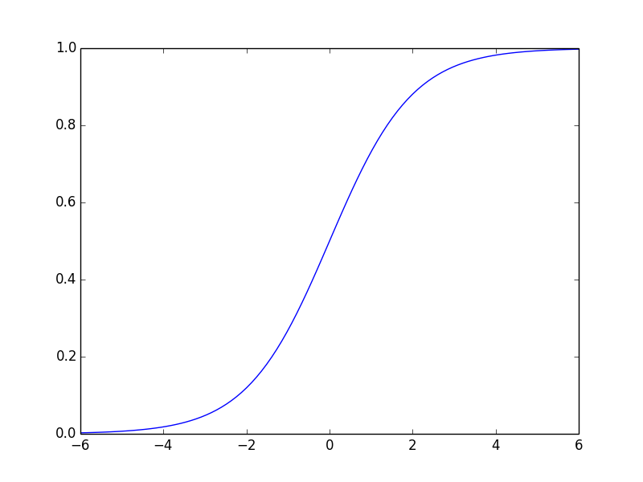

#Lab 03 - Benjamin Gross

##describe what the following methods of the array, a, do:

- shape

Return the dimensions of the `ndarray`

- dtype

Return the datatype of the elements of the array

- flatten

Transform the `n, m, j` array as a single dimension vector `len(n x m x j)`

- max/min

Return the `max / min` of the array or the matrix

- argmax/argmin

Return the index of the maximum or minimum (if `dim > 1`, can be tought of
  the index value for the "flattened" list)

- argsort

Return an index for the array that, when used as an index argument, would "sort"
the array (either `ascending = True`, or descending (`asending = False`))

- T

Transpose, a shortcut for the `transpose()` function

- copy

Because `python` mainly uses references, create copy of the object and allocate
it to memory

- diagonal

return the diagonal elements of the array

##Find the `sum` of each row of `a`

    In [23]: a = numpy.random.randint(1, 1000, (3, 4))

    In [24]: a
    Out[24]:
    array([[692, 498, 649, 211],
           [779, 759, 252, 603],
           [932, 352,  53, 999]])

    In [25]: a.sum(axis = 1)
    Out[25]: array([2050, 2393, 2336])

##Compare the Running Times

    In [26]: a = [numpy.random.random() for val in numpy.arange(1000)]

    In [27]: b = numpy.array(a)

    In [29]: %timeit numpy.max(a)
    10000 loops, best of 3: 71.4 µs per loop

    In [30]: %timeit b.max()
    100000 loops, best of 3: 3.96 µs per loop

##Compare the Running Times

    In [32]: %%timeit
       ....: a = []
       ....: for i in numpy.arange(1000):
       ....:     a.append(i)
       ....:
    1000 loops, best of 3: 209 µs per loop

    In [38]: %%timeit
      ....: b = numpy.array([])
      ....: for i in numpy.arange(1000):
      ....:     numpy.append(b, i)
      ....:
    100 loops, best of 3: 5.03 ms per loop

##Compare the Running Times of `numpy.sqrt`

    In [41]: %timeit numpy.sqrt(b)
    100000 loops, best of 3: 3.06 µs per loop

    In [42]: %timeit numpy.sqrt(a)
    10000 loops, best of 3: 67.6 µs per loop

##Strengths & Weaknesses of Arrays / Lists

Arrays are fast, so long as you don't need to change their shapes (as evidenced by the `append` functionality).  Lists have all kinds of great 'under-the-hood' functionality like list comprehensions, `filter`, `map`, `reduce`, etc.

##Constructors

Not really sure what you wanted, so:

	In [51]: numpy.array([1 if i == j else 2 for i in numpy.arange(3) for j in 	numpy.arange(3)]).reshape([3,3])
	
	Out[51]: 
	array([[1, 2, 2],
       	   [2, 1, 2],
           [2, 2, 1]])
       
	In [52]: numpy.arange(1, 13).reshape([3,4])

	Out[52]: 
	array([[ 1,  2,  3,  4],
    	   [ 5,  6,  7,  8],
       	   [ 9, 10, 11, 12]])
       	   
##Data Types

What results from operations between lists and arrays? Explain the result of the following cell:

A `numpy` array is returned where the i-th index of the list is added to the i-th index of the array

	In [60]: a = numpy.array([], dtype = 'int16')

	In [61]: b = numpy.array([], dtype = 'int64')
	
	In [62]: c = numpy.array([], dtype = 'float64')
	
	In [63]: d = numpy.array([], dtype = 'uint16')
	
	In [65]: a + b
	Out[65]: array([], dtype=int64)
	
	In [67]: a + c
	Out[67]: array([], dtype=float64)
	
	#OOOOOOOOH!!!!
	In [69]: a + d
	Out[69]: array([], dtype=int32)
	

###Explain What happens

	np.array([1, 4, 3.0, 6])
	
* Create a `numpy` array of floats

		np.array([1, 'a', 3, 7])
		
* Create an array of `string`s

		np.array(set([1, 4, 4, 5]))
	
* Create an `array` with the unique elements, `[1, 4, 5]`

##Functions

### Find the first 100 Triangular Numbers
		In [92]: fin = numpy.arange(1, 101)
		In [93]: t_nums = numpy.zeros(len(fin))
		
		In [91]: for i, val in enumerate(fin):
             t_nums[i] = numpy.arange(val, 0, -1).sum()
      
###Compute the matrix Product

	In [92]: a = numpy.array([[3, 4, 5],[5, 4, 3],[1, 2, 3]])

	In [93]: a
	Out[93]: 
	array([[3, 4, 5],
           [5, 4, 3],
           [1, 2, 3]])

	In [94]: b = numpy.array([10, 20, 30])

	In [95]: a.dot(b)
	Out[95]: array([260, 220, 140])       
	

###combine these vectors into a matrix

	In [100]: a, b, c = np.arange(4), np.arange(10, 14), np.arange(100, 140, 10)
	In [101]: numpy.vstack([a, b, c]).transpose()
	Out[101]: 
	array([[  0,  10, 100],
           [  1,  11, 110],
           [  2,  12, 120],
           [  3,  13, 130]])
           
      
###define a function that takes an array as input, and returns the logistic function applied to every element:

	In [108]: def logistic(arr):
   	.....:     return map( lambda x: 1./(1 + numpy.exp(-x)), arr)

###Verify Function Behaves Correctly

	In [107]: domain = numpy.linspace(-6, 6, 100)
	
	plt.plot(domain, logistic(domain))
	plt.show()

	

	